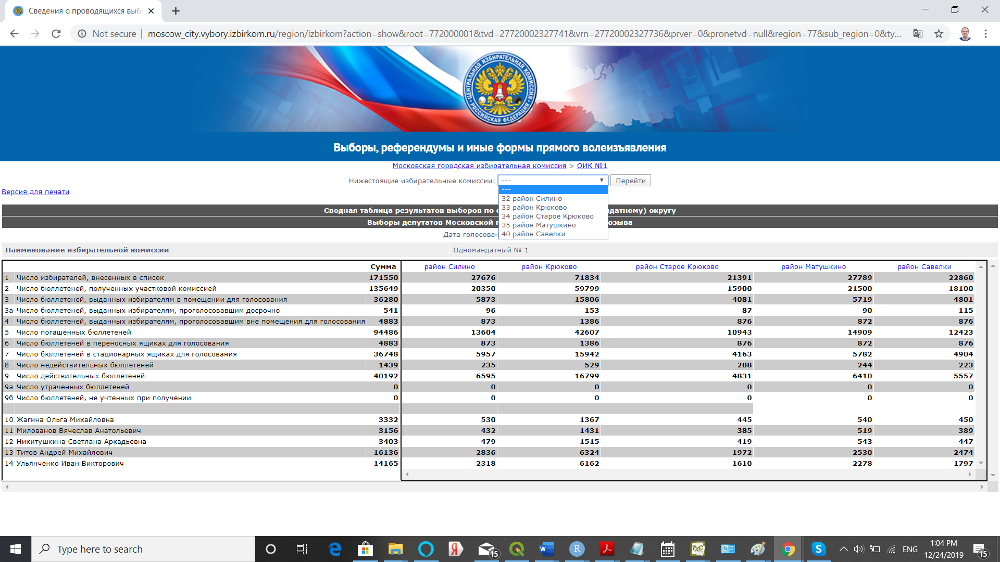

# CECscraper

**CECscraper** is an open source tool specifically designed for webscraping the data from the website of Central Election Commission (CEC, CIK).  Since CEC website is no longer available for webscrapping because of many captchas, this package uses its captcha-free mirror [http://notelections.online/](http://notelections.online/).  This package helps to implement a wide range of webscraping tasks related to different types of electoral data. The package's flexibility is stemming from its "bloc-building" approach: any webscraping task can be divided into a series of blocs technically supported by the package's functions.  Compliance with [ethical standards of webscraping](https://towardsdatascience.com/ethics-in-web-scraping-b96b18136f01) is left to user's discretion.

## I Extraction of electoral data
The webscraping algorithm consists of the building blocs expressed in the package's functions.  The scraping procedure is composed of two stages. On the first stage the user creates the data frame via the set of *URL extraction functions*, which includes target URLs and links (attributes directly linked to URLs), as well as attributes inherited from previous stages (called *level* or *info*). On the second stage, based on the URLs acquired from the first stage, the user builds the data frame containing electoral data via special data building function. 

To give you a taste of how easy the webscraping becomes, let us webscrape the precinct-level data for Moscow City Council election held on September 2019.  With this task in mind the sequence of scraping steps will be as follows.

First, load three libraries into the current **R** session. Then, open [http://notelections.online/](http://notelections.online/) in your web browser, and search for "Moscow City Council election, September 2019" to find the  *root URL* for this election.

    library(CECscraper)
    library(dplyr)
    library(rvest)

Second, click on the election link and copy-paste election's URL "http://notelections.online/region/izbirkom?action=show&vrn=27720002327736&region=77&prver=0&pronetvd=null" into a variable *root_url*
    
    root_url <- "http://notelections.online/region/izbirkom?action=show&vrn=27720002327736&region=77&prver=0&pronetvd=null"
    
Third, consider that CEC's hierarchy of URLs takes the following form **general election results -> election results for OIKs/SMDs -> election results for rayons -> election results for precincts**. Given that right now we find ourselves on the **general election results** page, we can proceed by obtaining URLs for OIKs. There are different ways of doing this. For instance, we can obtain a set of URLs for OIKs simply by clicking on the drop-down menu of "Нижестоящие избирательные комиссии".  This menu can be used to extract links and URLs of interest.  Let's extract them from the *root_url* page via the *listURLextractor()* function from *root_url* page.

    oiks_urls <- listURLextractor(root_url)
    
    oiks_urls[1,]

Notice that in our data the *link* variable directly refers to the scraped URLs. Check if we've collected the right set of URLs by copy-pasting one of the scraped URLs into your web browser.  Once the webpage is open in the web-browser, try to select items from a drop-down menu of "Нижестоящие избирательные комиссии".  That would give us access to URLs for rayons (i.e. units nested within OIKs).  Let's follow this logic and scrape appropriate rayons' URLs  from *oiks_urls* using the *listURLextractor()*.

    rayons_urls <- listURLextractor(oiks_urls)
    
    rayons_urls[1,]
    
Again, we need to check, if the right set of URLs was collected by copy-pasting one of the scraped URLs into your web browser.  Note that for rayons_url the links for OIKs and other auxiliary information are recorded in the *level* variables. The newly added *link* variable now contains the link information attributed to URLs.  This cumulative feature of *URL extraction functions* enables us to accumulate auxiliary data from the previous extraction stages or levels. 

Notice that since we are dealing with nested URLs, we can simplify our previous code by resorting to nested functions:

    rayons_urls <- listURLextractor(  #extract rayons
                        listURLextractor(root_url)  #extract OIKs
                            )

Again, to check if we've collected the right set of URLs simply copy-paste one of the scraped URLs into the web browser. Now it appears that we can't access the precinct-level data without clicking on the link
"сайт избирательной комиссии субъекта Российской Федерации".

Fourth, let's scrape all URLs associated with the link "сайт избирательной комиссии субъекта Российской Федерации" for all rayons_urls (such scraping would be equivalent to actual clicking on the link).  
Note that here all we need is just to copy-paste the link from the website "сайт избирательной комиссии субъекта Российской Федерации", and then properly transliterate it via the package's internal transliterator, *tranliterate()* function.

    rayons_urls2 <- rowURLextractor(rayons_urls, transliterate("сайт избирательной комиссии субъекта Российской Федерации"))
    
    rayons_urls2[1,]

As always, we need to check if extracted URLs are OK by copy-pasting one of the scraped URLs into the web browser.

Fifth, after choosing the items from a drop-down menu of "Нижестоящие избирательные комиссии", we are able to access the precinct-level data.  So, in this case let's use the *listURLextractor()* to collect URLs for precincts from the *rayons_urls2* object:

    uiks_urls <- listURLextractor(rayons_urls2)

Check if URLs in *uiks_urls* for precincts are OK by copy-pasting one of the URLs into the web browser.

Sixth, to access the precinct-level data we want to click on the link "Результаты выборов по одномандатному (многомандатному) округу".  In other words, we would need to use *rowURLextractor()* again. To speed up execution of our example, let's limit our webscraping example to the first 200 observations. 

    uiks_urlsD <- rowURLextractor(uiks_urls[1:200, ], transliterate("Результаты выборов по одномандатному (многомандатному) округу"))
    
Check if *uiks_urlsD* provide you with direct access to the precinct-level data by copy-pasting one of the URLs into your web browser.

Seventh, now we are ready to scrape precinct-level data using the *dataBuilder()* function.  We need to keep in mind several important parameters when using this function: 

  + *bylevel* is defined by *level* or *info* variables, and organizes the output as a list of SMDs (if *level* wasn't set up, our algorithm would erroneously attempt to merge all SMD data together). The *uiks_urlsD* data frame contains variable *level1* defining SMD per precinct.
  
  + *typedata="slow"*, whereas *slow* implies that the scraper visits all precinct-level pages to extract all the relevant data, i.e. webscraping is quite slow; *fast* implies scraping from the "Summary table of electoral results" with precinct-level data available per rayon-page, i.e. webscraping is fast (See *Tips for efficient webscraping*).
  
  + *dname=TRUE*, since we care about the names of SMD candidates we need to set this parameter to TRUE.  Quite often column names are automatically assigned basic names: for ballot counts "C1...Cn" and for candidates/parties) "P1...Pn".

Let's scrape the first 200 rows of our data.

    data_uiks <- dataBuilder(uiks_urlsD,  bylevel="level1", typedata = "slow", dnames = TRUE)
     
    names(data_uiks$data)

Eighth, the data is a list of data frames defined by variable *level1*.  To merge all the data together one needs to apply *dataMerger()* with parameter *byrow = TRUE*, i.e. the data needs to be merged by row. 

     data_uiks_merged <- dataMerger(data_uiks, byrow = TRUE) 

To access the webscraped data: 

     edit(data_uiks_merged$data)

Note that we've just described only one webscraping path out of several possible paths.  We could implement our webscraping algorithm in a slightly different manner:

    root_url <- "http://notelections.online/region/izbirkom?action=show&vrn=27720002327736&region=77&prver=0&pronetvd=null"

    root_urlsD <- rowURLextractor(root_url, transliterate("Данные о предварительных итогах голосования по одномандатному (многомандатному) округу"))
    oiks_urls <- listURLextractor(root_urlsD)
    rayons_urls <- listURLextractor(oiks_urls)
    rayons_urls2 <- rowURLextractor(rayons_urls, transliterate("сайт избирательной комиссии субъекта Российской Федерации"))
    uiks_urls <- listURLextractor(rayons_urls2)
    data_uiks <- dataBuilder(uiks_urls[1:100,],  bylevel="level2", typedata = "slow", dnames = TRUE)
    data_uiks_merged <- dataMerger(data_uiks, byrow = TRUE) 

    #an alternative with pipe operator
    library(dplyr)
       
    data_uiks<- rowURLextractor(root_url, transliterate("Данные о предварительных итогах голосования по одномандатному (многомандатному) округу"))%>%
                listURLextractor() %>%
                listURLextractor() %>%
                rowURLextractor(transliterate("сайт избирательной комиссии субъекта Российской Федерации")) %>%
                listURLextractor() %>%
                dataBuilder(bylevel="level2", typedata = "slow", dnames = TRUE) %>%
                dataMerger(byrow = TRUE) 

The description of the third webscraping path using *fast* method is provided in *Task 3*.
  
    
 
## II Basic functions
### URL extraction functions:

1. <em>fileURLextractor (html_file, tabextract = NULL, hashid = FALSE)</em>

    This function extracts election-related links and urls from an html page of the Central Election Commission.
    
    + *html_file* -- html file object.
    +	*tabextract* -- a table number to extract in order to override the table selection algorithm.
    +	*hashid* -- generate a unique md5 hash id for election (TRUE).

2. <em>listURLextractor (x)</em> 
    
    This function extracts links and urls from the lists or menus.
    
    +	*x* -- link, list of links, data frame with links or rowURLextractor() object.

3. <em>rowURLextractor (x, item, select = 1)</em>

    This function extracts the links and urls from the webpage.
    
    +	*x* -- list of urls orlistURLextractor() object.
    +	*item* -- link/expression that contains the url of interest.
    +	*select* -- if more than one matched rows are found, define which one to work with.

### Data building function:
4.  <em> dataBuilder (x, bylevel = NULL, ttime = FALSE, typedata = "slow", dnames = FALSE, tabextract = NULL, savetodir = "")</em> 

    This function builds the data frame from URLs or listURLextractor/rowURLextractor objects.
    
    +	*x* -- link/list/data frame with links.
    +	*bylevel* -- defines data subsets as an output; by default, the whole data set will be returned.
    + *ttime* -- checks if extracted data contains reported turnout during election day (TRUE) or not (FALSE).
    +	*typedata* -- "slow" if the data is extracted from "rezultaty vyborov" link (slow approach); "fast" if the data is extracted from "svodnya tablitsa" (pivot table) (fast approach).
    +	*dnames* -- assign original labels to column names(TRUE).
    +	*tabextract* -- select the table number to extract in order to override the table selection algorithm.
    +	*savetodir* -- save html data files to a specified directory, i.e. "C:/Documents".

### Pipe building/extraction functions:
5.  <em> autoPipeSearch (x, ttime, blocks, search.term, hits, extracturls, breakloop, messages) </em>
  
    This function automatically constructs the data extraction pipe for a given election.
  
    + *x* -- url, list of urls.
    + *ttime* -- checks if data covers reported turnout over election day (TRUE) or not (FALSE).  ttime is valid when blocks=NULL
    + *blocks* -- vector of blocks to be used to construct a pipe. blocks override ttime parameters. By default, c("listURLextractor()", "rowURLextractor('sayt izbiratel`noy komissii sub`yekta')", "rowURLextractor('Itogi golosovaniya|Rezul`taty vyborov')").
    + *search.term* once a stop term is detected, the algorithm stops building the pipe (by default, search.term="UIK|uik|uchastok"").
    + *hits* number of times the stop word is "hit" by the algorithm. Each time the stop word is "hit", extra block is added to the pipe (by default, hits=2).
    + *extracturls* urls are extracted using the pipe or the list of pipes (by default, extracturls=FALSE).
    + *breakloop* maximum number of iterations for optimal path search (by default, breakloop=100).
    + *messages* display progress messages (messages = FALSE).

6.  <em> execPipeList (x, messages) </em>

    This function extracts URLs from the pipe saved in the autoPipeSearch object.

    + *x* autoPipeSearch object containing pipe.table that can be manually modified if desired.
    + *messages* display progress messages (messages = FALSE).

### Auxiliary functions:
7.  <em> dataMerger(x, byrow = TRUE) </em> 
    
    This function merges the list of data objects together.
    
    +	*x* -- list of data objects.
    +	*byrow* -- list is merged by row or by column.  If byrow==FALSE only two objects are merged into a list.

8.  <em> eftFormatter(x, Nvalid = "CEC", levels = TRUE) </em> 

    This function reformats the data for its use with Election Forensics Toolkit.
  
    +	*x* -- the object from Databuilder/DataMerger function.
    +	*Nvalid* -- valid votes computed using either "CEC" (Central Election Comission's formula); "AllVotes" (total number of votes cast for all candidates).
    +	*levels* -- add information on levels (TRUE) or not (FALSE) to the output.

9.  <em> transliterate(v) </em>

    Returns transliterated expression.
    
    +	*v* -- expression in Cyrillic.

### Extraction of the candidate-related data
10. <em> scrapeCandidates(x, tabextract = NULL, savetodir = "") </em> 

    This function extracts the candidate-related data from the webpages.
    
    +	*x* -- url, list of urls.
    +	*tabextract* -- select the table number to extract in order to override the table selection algorithm.
    +	*savetodir* -- save downloaded html data files to directory, i.e. "C:/Documents".

## III Tips for efficient webscraping with the *CECscraper* package

1.	Long-Path Approach vs. Short-Path Approach

    Long-Path approach assumes that URL accumulation starts with *fileURLextractor()* function.  In other words, after initial data search using the CEC website, all search results are expected to be saved into a single html file that would be used by *fileURLextractor()* function.  In contrast, the short-path approach assumes that the user can feed URLs directly into the list and row extraction functions without resorting to *fileURLextractor()* function (this approach reduces the number of steps, therefore it is called "short").  The latter approach, however, may prevent the user from getting certain *level* attributes like the date of election or election-specific hashids required for unique election identifiers.

2.	Automated Webscraping vs. Looping

    With the help of *dataBuilder()* it is possible to webscrape literary hundreds of elections and collect data across thousands of locations, but this can also drastically increase the chances of arbitrary errors in one of the elections and high probability of losing all previously scraped data.  If the user attempts to webscrape many elections at once, a more prudent approach would be to place *CECscraper* functions within the loop and save the data as R objects using *saveRDS()* function in R. 

3.	Slow Webscraping vs. Fast Webscraping

    On the website of the Central Election Commission electoral data is provided in two different formats:  *Rezul`taty vyborov* (Election results) and *Svodnaya tablitsa rezul`tatov vyborov* (*Summary table of election results*).  If the first format is taking relatively long time to scrape (it contains deeper data structure with less data per page), the second format is much faster (it contains shallower data structure with more information per page).  Both approaches "slow" or "fast" can be used interchangeably, but slow webscraping can be more error prone.

4.	Table Search Automation vs. Manual Selection

    Both *dataBuilder()* and *scrapeCandidates()* functions contain in-built detection algorithm designed to automatically select the table used for data extraction.  The webpage can embed more than a dozen of tables and subtables.  An error message produced by *dataBuilder()* or  *scrapeCandidates()* often results from algorithm's failure to detect correct "extractable"  table.  In that case, the user needs to set a table number via *tabextract* parameter manually by applying the trial-and-error approach.
                                     
5.	Transliteration

    All Cyrillic characters are internally transliterated.  In order to use *rowURLextractor()* efficiently, the user needs to transliterate Cyrillic text via the  *transliterate()* function.

## Examples

### *Task 1: Webscrape the region-level electoral data for presidential election 2018 using the slow webscraping approach.*

Let’s use the short-path approach by feeding root URL into a set of URL extractor functions.  This task can be broken down into a sequence of steps:

    

  
    #Code Fragment 
    
    library(CECscraper)

    url<-"http://notelections.online/region/izbirkom?action=show&global=1&vrn=100100084849062&region=0&prver=0&pronetvd=null" #See Picture 1
    res1 <- rowURLextractor(url, transliterate("Результаты выборов"), select = 1) #See Picture 2

    #Code Fragment
    
    res2 <- listURLextractor(res1)  #See Picture 3
    res3 <- dataBuilder(res2, ttime = FALSE, typedata = "slow", dnames = TRUE)
    View(res3$data)
    
    
  
    #Full code

    library(CECscraper)

    url<-"http://notelections.online/region/izbirkom?action=show&global=1&vrn=100100084849062&region=0&prver=0&pronetvd=null" #See Picture 1
    res1 <- rowURLextractor(url, transliterate("Результаты выборов"), select = 1) #See Picture 2
    res2 <- listURLextractor(res1)  #See Picture 3
    res3 <- dataBuilder(res2, ttime = FALSE, typedata = "slow", dnames = TRUE)
    View(res3$data)

### *Task 2: Webscrape the region-level data for all gubernatorial elections that occured on September 8, 2019 using slow approach.* 
Since we need to download many elections it is more convenient to use the long-path approach.

Picture 4

Picture 5

    
    #Code Fragment

    library(CECscraper)
    library(rvest)
     
    webpage <- read_html("Inst/gubernatorial_sept2019.html") #See Picture 4 and Picture 5
    res1 <- fileURLextractor(webpage, hashid = TRUE)

Picture 6

    #Code Fragment

    res2 <- rowURLextractor(res1, transliterate("Результаты выборов"), select = 1) #See Picture 6
    res3 <- dataBuilder(res2, ttime = FALSE, typedata = "slow", dnames = TRUE, bylevel="level2")
    names(res3$data)
    
    res4 <- dataMerger(res3, byrow = TRUE) 
    View(res4$data)
  

    #Full code
    
    library(CECscraper)
    library(rvest)
     
    webpage <- read_html("Inst/gubernatorial_sept2019.html") #See Picture 4 and Picture 5
    res1 <- fileURLextractor(webpage, hashid = TRUE)
    res2 <- rowURLextractor(res1, transliterate("Результаты выборов"), select = 1) #See Picture 6
    res3 <- dataBuilder(res2, ttime = FALSE, typedata = "slow", dnames = TRUE, bylevel="level2")
    names(res3$data)
    res4 <- dataMerger(res3, byrow = TRUE) 
    View(res4$data)

### *Task 3: Webscrape precinct-level data (time and electoral data) as well as the data on candidates for Moscow City Duma election held on September 2019 using the fast approach. 

Picture 7

Picture 8

    #Code Fragment
    
    library(CECscraper)
    library(dplyr)
    
    url<-"http://www.vybory.izbirkom.ru/region/izbirkom?action=show&vrn=27720002327736&region=77&prver=0&pronetvd=null" #See Picture 7 and Picture 8
    
    res1 <- rowURLextractor(url, transliterate("Сводная таблица предварительных итогов голосования")) #See Picture 8
 
Picture 9

Picture 10

    #Code Fragment

    res2 <- listURLextractor(res1)  #See Picture 9
    res3 <- listURLextractor(res2)  #See Picture 10

Picture 11

Picture 12

    #Code Fragment

    res4 <- rowURLextractor(res3, transliterate("сайт избирательной комиссии субъекта Российской Федерации")) #See Picture 11
    res5 <- dataBuilder(res4, typedata = "fast", dnames = TRUE, bylevel="level3") #See Picture 12

  

    #Full code

    library(CECscraper)
    library(dplyr)

    ###########################
    #extracting electoral data#
    ###########################
    url<-"http://notelections.online/region/izbirkom?action=show&vrn=27720002327736&region=77&prver=0&pronetvd=null" #See Picture 7 and Picture 8
    
    res1 <- rowURLextractor(url, transliterate("Сводная таблица предварительных итогов голосования")) #See Picture 8
    res2 <- listURLextractor(res1)  #See Picture 9
    res3 <- listURLextractor(res2)  #See Picture 10
    res4 <- rowURLextractor(res3, transliterate("сайт избирательной комиссии субъекта Российской Федерации")) #See Picture 11
    res5 <- dataBuilder(res4, typedata = "fast", dnames = TRUE, bylevel="level2") #See Picture 12
    
    #an alternative with pipe operator
    res5 <- rowURLextractor(url, transliterate("Сводная таблица предварительных итогов голосования")) %>%
              listURLextractor() %>%
              listURLextractor() %>%
              rowURLextractor(transliterate("сайт избирательной комиссии субъекта Российской Федерации")) %>%
              dataBuilder(typedata = "fast", dnames = TRUE, bylevel="level2")
    
    #############################
    #extracting time information#
    #############################
    res1t <- rowURLextractor(url, transliterate("Данные об открытии помещений для голосования"))
    res2t <- listURLextractor(res1t)
    res3t <- listURLextractor(res2t)
    res4t <- rowURLextractor(res3t, transliterate("сайт избирательной комиссии субъекта Российской Федерации"))
    res5t <- dataBuilder(res4t, typedata = "fast", ttime = TRUE, dnames = TRUE, bylevel="level2")
    
    #an alternative with pipe operator
    res5t <- rowURLextractor(url, transliterate("Данные об открытии помещений для голосования")) %>%
               listURLextractor() %>%
               listURLextractor() %>% 
               rowURLextractor(transliterate("сайт избирательной комиссии субъекта Российской Федерации")) %>%
               dataBuilder(typedata = "fast", ttime = TRUE, dnames = TRUE, bylevel="level2")
    
    ###############################
    #merging electoral + time data#
    ###############################
    res6 <- dataMerger(list(res5, res5t), byrow = FALSE)
    res7 <- dataMerger(res6, byrow = TRUE) 
    
    #remove extra rows for rayons
    res8 <- res7$data[grepl("^UIK", res7$data$link),]
    
    ###############################
    #extracting info on candidates#
    ###############################
    urlc <- "http://notelections.online/region/moscow_city?action=show&root=1&tvd=27720002327740&vrn=27720002327736&region=77&global=null&sub_region=0&prver=0&pronetvd=null&vibid=27720002327736&type=220"
    resc <- scrapeCandidates(urlc)

### *Task 4: Webscrape country-level data for all federal elections (both presidential and parliamentary elections). 
    
    library(CECscraper)
    library(dplyr)
    library(rvest)
     
    webpage <- read_html("Inst/elections_federal.html") #See Picture 4 and Picture 5
    res1 <- fileURLextractor(webpage, hashid = TRUE)
    
    filter1<-paste(c(transliterate("Результаты выборов"), transliterate("Итоги голосования по федеральному округу")), collapse="|")
    res2 <- rowURLextractor(res1[c(1:6,8),], filter1, select = 1)
    res3 <- rowURLextractor(res1[7,], transliterate("Результаты выборов по федеральному избирательному округу"), select = 1)
    resm <- rbind(res2,  res3)    
    resm$level5 <-  paste(resm$level1, resm$level4)
    res3 <- dataBuilder(resm, ttime = FALSE, typedata = "slow", dnames = TRUE, bylevel="level5")
    
    names(res3$data)

### *Task 5: Webscrape the SMD electoral data for 2016 State Duma elections. webscrape  candidate's party ID, and then reformat the data using CLEA's formatting guidelines ([CLEA website](http://www.electiondataarchive.org/data-and-documentation.php)).  

    #Full code

    library(CECscraper)
    library(dplyr)
    
    #Scrape SMD data
    url2016<-"http://notelections.online/region/izbirkom?action=show&global=1&vrn=100100067795849&region=0&prver=0&pronetvd=0"
    
    p0<-rowURLextractor(url2016, transliterate("Результаты выборов по одномандатному избирательному округу"), select=1)%>%
        listURLextractor()%>%
        listURLextractor()%>%
        dataBuilder(typedata="slow", bylevel="link", ttime=FALSE, dnames=TRUE)%>%
        dataMerger()
    
    p1 <- t(p0$data)
    p2 <- p1[-c(1:24),]
    oiks <- p1[5,]
    oiks_oik <- unlist(sapply(1:length(oiks), function(i){rep(oiks[i], sum(!is.na(p2[,i])))}))
    oiks_num <- gsub("[^0-9.]", "",  oiks_oik)
    oiks_votes <- unlist(sapply(1:length(oiks), function(i){  p2[,i][!is.na(p2[,i])]}))
    oiks_names <- as.character(names(oiks_votes))
    candidates_data <- data.frame(oiks_oik, oiks_num, oiks_names, oiks_votes, stringsAsFactors = FALSE)
    candidates_data$ind <- paste(candidates_data$oiks_names, candidates_data$oiks_num, sep="_")
    
    oiks_num <- gsub("[^0-9.]", "",  oiks)
    electoral_info <- data.frame(cbind(oiks, oiks_num, t(p1[c(7:24),])), stringsAsFactors = FALSE)
    
    #Scrape the data on candidate's party ID
    candidates="http://notelections.online/region/izbirkom?action=show&root=1&tvd=100100067795854&vrn=100100067795849&region=0&global=true&sub_region=0&prver=0&pronetvd=0&vibid=100100067795849&type=220"
    smd.candidates<-scrapeCandidates(candidates)
    smd.candidates2<-subset(smd.candidates$data, select=c("FIO.kandidata", "Nomer.okruga", "Status.kandidata.4", "Sub.yekt.vydvizheniya"))
    smd.candidates3<-smd.candidates$data[,c("FIO.kandidata", "Nomer.okruga", "Status.kandidata.4", "Sub.yekt.vydvizheniya", "Status uchastnika vyborov")]
    smd.candidates3$ind<-paste(apply(smd.candidates3["FIO.kandidata"],1,as.character), 
                               apply(smd.candidates3["Nomer.okruga"],1,as.character), sep="_")
    
    #Merge the data
    merged_data<-merge(candidates_data, smd.candidates3, by="ind")
    merged_data2<-subset(merged_data, select=c("oiks_oik", "oiks_num", "oiks_names", "oiks_votes", "Sub.yekt.vydvizheniya"))
    merged_data3<-merge(electoral_info, merged_data2, by="oiks_num")
    
    #write.csv(merged_data3, "Russia2016_SMD.csv")

### *Task 6: Webscrape the 2018 Primorye gubernatorial elections using autoPipeSearch() and execPipeList() functions.  

    #Full code

    library(CECscraper)
    library(dplyr)
    library(rvest)
     
    webpage <- read_html(system.file("elections_primorye.html", package="CECscraper"))
    
    #Example 1
    wterrit <- webpage%>%
               fileURLextractor(hashid = FALSE)
    #uik_url1 <- wterrit%>%
    #            autoPipeSearch(extracturls=TRUE, ttime=FALSE)
    uik_url1 <- wterrit%>%
                autoPipeSearch(ttime=TRUE)
    uik_url2 <- uik_url1%>%
                execPipeList()
    #uik_url3 <-uik_url2%>%
    #           dataBuilder(ttime=FALSE)
    uik_url3 <- uik_url2%>%
                dataBuilder(ttime=TRUE)
    
    #Example 2
    uik_url1 <- wterrit%>%autoPipeSearch(blocks=c("listURLextractor()",
                                                  "rowURLextractor('sayt izbiratel`noy komissii sub`yekta')",
                                                  "rowURLextractor('Svodnaya tablitsa')"),  hits=3, search.term="Svodnaya tablitsa")
    uik_url2 <- uik_url1%>%
                execPipeList()%>%
                uik_url2 %>% dataBuilder(typedata = "fast")
    
    #Example 3
    uik_url1 <- wterrit%>%autoPipeSearch(blocks=c("listURLextractor()",
                                                  "rowURLextractor('sayt izbiratel`noy komissii sub`yekta')",
                                                  "rowURLextractor('Dannyye ob otkrytii pomeshcheniy')"),  
                                                   hits=3, search.term="Dannyye ob otkrytii pomeshcheniy")
    uik_url2 <- uik_url1%>%
                execPipeList()%>%
                dataBuilder(ttime = TRUE, typedata = "fast")
    
    
    #Example 4
    uik_url1 <- wterrit%>%autoPipeSearch(blocks=c("listURLextractor()",
                                                  "rowURLextractor('sayt izbiratel`noy komissii sub`yekta')",
                                                  "rowURLextractor('Svedeniya o kandidatakh')"),  
                                                   hits=1, search.term="Svedeniya o kandidatakh")
    uik_url2 <- uik_url1%>%
                execPipeList()%>%
                scrapeCandidates(tabextract = NULL, savetodir = "")
